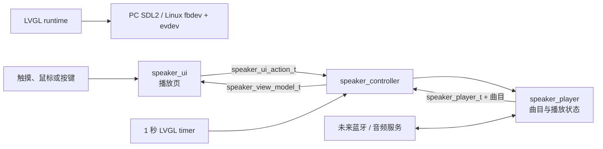
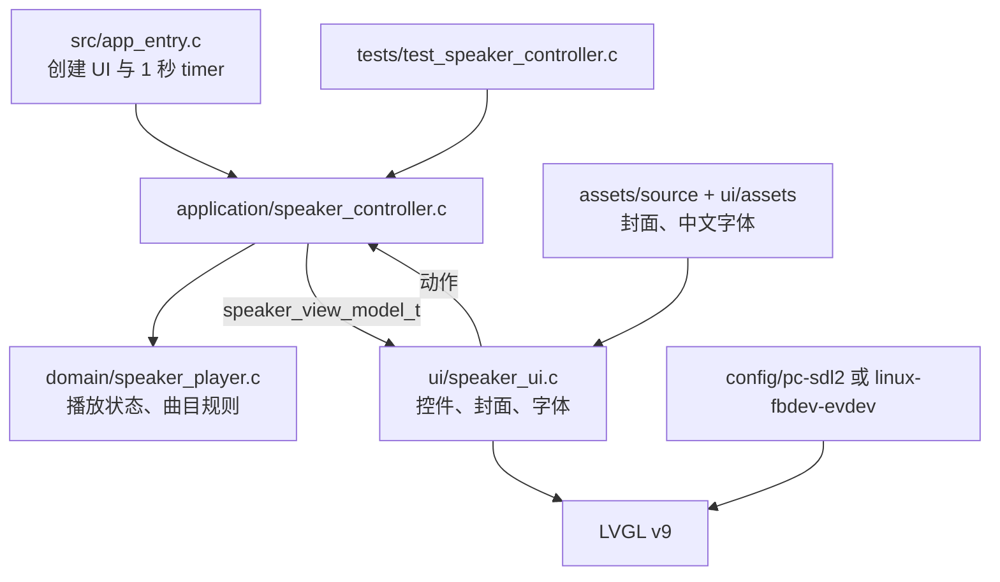
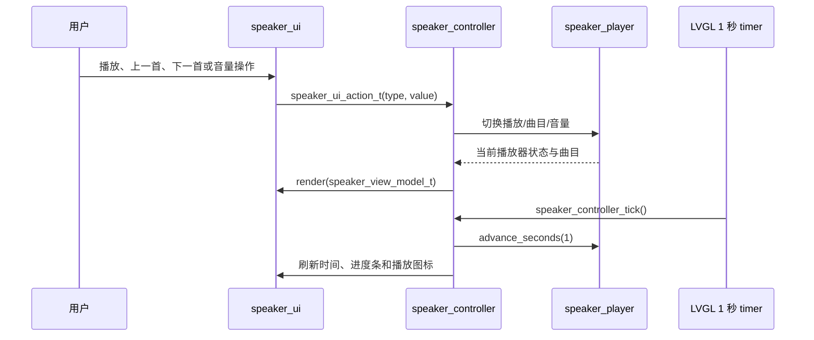

# bluetooth-speaker

`bluetooth-speaker` 是面向 480×640 竖屏的中文蓝牙音箱“正在播放”界面 Demo。它用模拟曲目、连接状态和播放进度演示可交互 LVGL 页面，并保留未来替换为蓝牙协议和真实音频服务的分层边界。

## 1. 应用目标与边界

- **目标**：显示“蓝牙音箱 / 已连接”、专辑封面、曲目/歌手、播放进度、上一首/播放暂停/下一首与音量。
- **当前能力**：模拟曲目列表、播放状态、音量和每秒推进的播放进度；全部控件可交互。
- **模拟边界**：未连接真实蓝牙协议、音频解码器、功放或存储卡；播放进度由 LVGL 定时器模拟。
- **真实硬件边界**：未来由 Application/Domain 外接蓝牙和音频适配器，页面、动作与 ViewModel 保持稳定。

## 2. 快速运行

在单仓根目录启动 480×640 PC SDL2 模拟器：

```powershell
cmake -S . -B build/pc-speaker -G Ninja `
  -DLVGL_APP=bluetooth-speaker `
  -DLVGL_TARGET=pc-sdl2 `
  -DLVGL_SERIES=9
cmake --build build/pc-speaker
ctest --test-dir build/pc-speaker --output-on-failure
.\build\pc-speaker\apps\bluetooth-speaker\bluetooth_speaker.exe
```

在 Linux 主机或交叉编译环境构建：

```sh
./scripts/build-linux.sh bluetooth-speaker
LVGL_CODEX_FBDEV=/dev/fb0 LVGL_CODEX_EVDEV=/dev/input/event0 \
  ./build/linux-bluetooth-speaker/apps/bluetooth-speaker/bluetooth_speaker
```

导出为 Git subtree 后，在应用根目录按锁定版本构建；需要本地调试框架时传入路径：

```sh
cmake -S . -B build/pc -G Ninja \
  -DLVGL_TARGET=pc-sdl2 \
  -DLVGL_SERIES=9 \
  -DLVGL_CODEX_FRAMEWORK_SOURCE=/path/to/LVGL-Codex
cmake --build build/pc
ctest --test-dir build/pc --output-on-failure
```

## 3. 总体架构



真实蓝牙状态和音频回调未来应替换 `speaker_player` 的模拟数据来源，不能让 LVGL 回调直接访问协议栈或音频驱动。

## 4. 代码架构



| 位置 | 关键内容 | 新手关注点 |
| --- | --- | --- |
| `src/app_entry.c` | `playback_timer` 与统一渲染 | 定时推进也必须回到 Controller |
| `domain/` | `speaker_player_t`、曲目和播放规则 | 未来音频/蓝牙状态的可替换边界 |
| `application/` | `speaker_controller_t` | 动作、tick 与 ViewModel 映射 |
| `ui/` | `speaker_ui_create/render` | LVGL 页面不包含播放器实现 |
| `ui/assets/` | RGB565 封面、裁剪字体 | 运行时不依赖 JPEG 解码 |
| `tests/` | 播放控制和时间推进测试 | 无 LVGL 的行为回归 |

## 5. 运行与交互流程



音量滑条的 `value` 与操作类型一同放入 `speaker_ui_action_t`；UI 只传递数值，音量范围与业务规则由领域层保持。

## 6. 代码地图

1. 从 `ui/include/speaker_ui.h` 阅读四种动作与 `speaker_view_model_t` 字段。
2. 阅读 `application/src/speaker_controller.c`，理解动作和 `speaker_controller_tick()` 如何映射播放状态。
3. 阅读 `domain/src/speaker_player.c`，查看播放/暂停、切歌、音量与进度边界规则。
4. 阅读 `src/app_entry.c`，理解为何定时器只调用 Controller 并重渲染。
5. 最后阅读 `ui/src/speaker_ui.c` 与 `ui/assets/`，理解页面布局、事件绑定和资源使用。
6. 阅读 `tests/test_speaker_controller.c`，覆盖用户动作、时间推进及 ViewModel 输出。

## 7. 分层原理

- `speaker_ui` 只发出上一首、播放暂停、下一首和设置音量等语义动作，不直接修改 `speaker_player_t`。
- `speaker_player` 只依赖标准 C；未来可由真实蓝牙连接、音频引擎或串口协议驱动，不依赖 LVGL。
- `speaker_view_model_t` 是页面唯一的数据输入，UI 不需要知道曲目切换、循环或音量边界规则。
- 定时器事件与用户事件均经 Controller 进入同一渲染回路，避免进度条和文本分别维护状态。

## 8. 新功能开发流程

新增“设备列表”“均衡器”或真实蓝牙事件时：

1. 先在 `speaker_player` 或新的纯 C 服务契约中定义状态、事件和规则。
2. 在 `speaker_ui_action_t`、`speaker_view_model_t` 增加语义动作和展示字段。
3. 由 `speaker_controller` 处理动作/外部事件并生成完整 ViewModel；为其添加无 LVGL 测试。
4. 在 `speaker_ui.c` 增加页面、路由与控件，回调只发出动作。
5. 若使用真实蓝牙/音频驱动，在 Linux/MCU Port 或 board 包适配，禁止在 UI 中直接调用驱动。
6. 同步更新本 README 的能力边界、Mermaid 图、资源说明与验收步骤。

不要在 `speaker_ui.c` 中包含 `speaker_player.h`，也不要让领域层依赖 `lv_timer_t` 或 LVGL 类型。

## 9. 平台移植、资源与排错

- `app_manifest.cmake` 固定 PC SDL2 窗口为 480×640；Linux/MCU 屏幕尺寸和旋转由独立 `lv_conf.h`、Port 与 board 配置决定。
- Linux 通过 `LVGL_CODEX_FBDEV` 与 `LVGL_CODEX_EVDEV` 指定显示和输入设备；确认 RGB565/ARGB 像素格式、触摸坐标与权限。
- MCU 移植时接入显示 flush、触摸、tick 和音频/蓝牙适配器；Domain、Controller 与页面动作接口无需因芯片变化而重写。
- 原始专辑封面在 `assets/source/album_cover.jpg`，LVGL 可编译资源在 `ui/assets/album_cover.c`；来源和 Unsplash 许可见 `assets/ATTRIBUTION.md`，资源处理说明见 `assets/README.md`。`speaker_font.c` 是裁剪后的中文字形资源。
- 排错顺序：先运行 CTest 验证播放规则，再在 PC 检查交互与布局，最后检查目标 `lv_conf.h`、帧缓冲、输入节点和资源内存占用。
