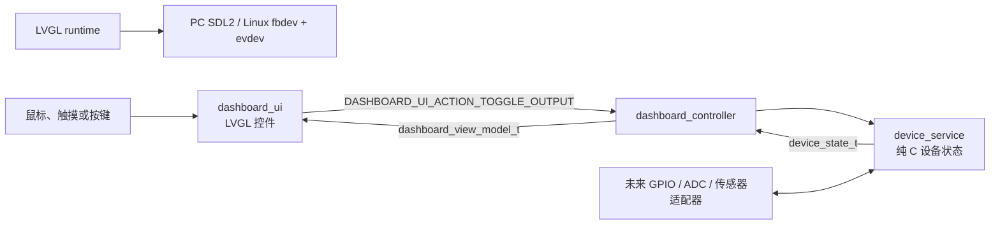
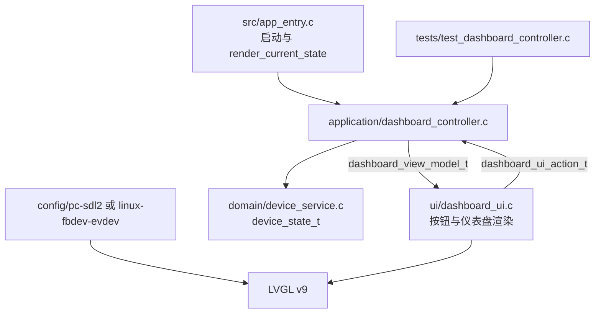
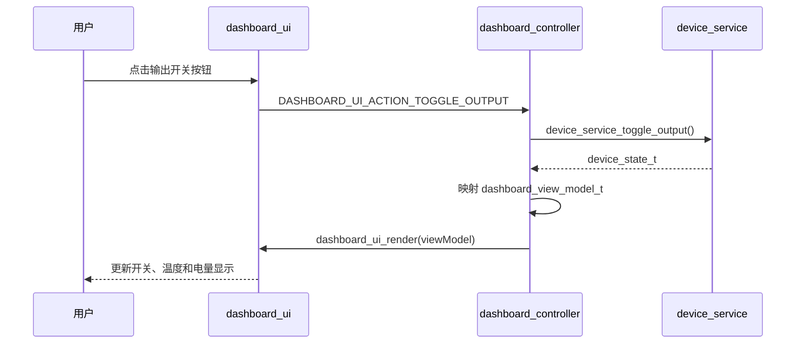

# device-dashboard

`device-dashboard` 是 LVGL-Codex 的最小可运行参考应用：一个 800×480 横屏设备仪表盘。它演示了“按钮动作 → 领域状态 → ViewModel → LVGL 重绘”的完整闭环，是新页面和新设备控制功能的起点。

## 1. 应用目标与边界

- **目标**：展示设备输出开关、温度和电池电量，并允许用户切换输出状态。
- **当前能力**：`DASHBOARD_UI_ACTION_TOGGLE_OUTPUT` 切换模拟的 `output_enabled`；温度和电量为静态模拟数据。
- **模拟边界**：PC SDL2 只模拟窗口、鼠标与显示；不控制真实 GPIO、ADC、电池或传感器。
- **真实硬件边界**：未来由 Linux/MCU 的服务适配器读取硬件数据或写入输出；UI 与 Controller 接口保持不变。

## 2. 快速运行

在单仓根目录构建 PC SDL2 模拟器：

```powershell
cmake -S . -B build/pc-dashboard -G Ninja `
  -DLVGL_APP=device-dashboard `
  -DLVGL_TARGET=pc-sdl2 `
  -DLVGL_SERIES=9
cmake --build build/pc-dashboard
ctest --test-dir build/pc-dashboard --output-on-failure
.\build\pc-dashboard\apps\device-dashboard\device_dashboard.exe
```

在 Linux 主机或交叉编译环境构建 fbdev/evdev 版本：

```sh
./scripts/build-linux.sh device-dashboard
LVGL_CODEX_FBDEV=/dev/fb0 LVGL_CODEX_EVDEV=/dev/input/event0 \
  ./build/linux-device-dashboard/apps/device-dashboard/device_dashboard
```

导出为 Git subtree 后，应用根目录的 `CMakeLists.txt` 会根据 `framework_lock.cmake` 下载锁定框架；开发框架时可指定本地路径：

```sh
cmake -S . -B build/pc -G Ninja \
  -DLVGL_TARGET=pc-sdl2 \
  -DLVGL_SERIES=9 \
  -DLVGL_CODEX_FRAMEWORK_SOURCE=/path/to/LVGL-Codex
cmake --build build/pc
ctest --test-dir build/pc --output-on-failure
```

## 3. 总体架构



运行时和 Port 只处理 LVGL 生命周期、显示与输入。`device_service` 是不含 LVGL 的领域层，未来替换为真实硬件时不要求重写仪表盘 UI。

## 4. 代码架构



| 位置 | 关键内容 | 新手关注点 |
| --- | --- | --- |
| `src/app_entry.c` | 启动、动作回调、统一渲染 | UI 回调最终回到 Controller |
| `domain/` | `device_service_t`、`device_state_t` | 真实设备规则的归属 |
| `application/` | `dashboard_controller_t` | 处理动作并生成 ViewModel |
| `ui/` | `dashboard_ui_create/render` | LVGL 对象只在此层出现 |
| `config/` | 各目标的 `lv_conf.h` | 分辨率、颜色深度、输入功能 |
| `tests/` | Controller 逻辑测试 | 不启动 LVGL 即验证映射 |

## 5. 运行与交互流程



`render_current_state()` 是应用入口中的统一回流点。UI 不保存业务真相，也不调用 `device_service_toggle_output()`。

## 6. 代码地图

1. 从 `ui/include/dashboard_ui.h` 阅读动作枚举和 `dashboard_view_model_t`。
2. 阅读 `application/src/dashboard_controller.c`，理解动作到领域调用、领域状态到 ViewModel 的双向映射。
3. 阅读 `domain/src/device_service.c`，查看模拟状态与输出切换规则。
4. 最后阅读 `ui/src/dashboard_ui.c`，理解 LVGL 标签、按钮和回调的创建方式。
5. 阅读 `tests/test_dashboard_controller.c`，为新状态或动作添加可重复的断言。

## 7. 分层原理

- UI 按钮只发出 `DASHBOARD_UI_ACTION_TOGGLE_OUTPUT`，因此将来可由物理按键或网络命令触发同一用例。
- `device_service` 只使用 C 标准类型，不能包含 LVGL、SDL、Linux 或板级头文件；可迁移并可独立测试。
- `dashboard_view_model_t` 把领域状态变成仪表盘需要的字段。UI 只渲染该模型，不判断输出控制规则。
- LVGL v9 与平台差异位于框架、Port 和 `config/`，应用业务层不散落版本或平台条件编译。

## 8. 新功能开发流程

新增“低电量告警”或“设置页面”时：

1. 先在 `device_state_t` 增加真实业务状态和领域用例。
2. 为 `dashboard_view_model_t` 增加纯展示字段，必要时在 `dashboard_ui_action_t` 增加语义动作。
3. 在 Controller 中处理动作并映射新字段；为动作、边界值和 ViewModel 编写测试。
4. 在 `dashboard_ui.c` 增加 LVGL 控件，并仅在回调中发出动作。
5. 同步更新本 README 的能力、图表、代码地图和手动验收步骤。

不要在 `dashboard_ui.c` 中包含 `device_service.h` 或直接修改 `device_state_t`。

## 9. 平台移植、资源与排错

- `config/pc-sdl2/lv_conf.h` 用于 800×480 PC 模拟器；Linux 使用独立的 `config/linux-fbdev-evdev/lv_conf.h`。
- Linux 运行前确认 `/dev/fb0`、`/dev/input/event0` 权限、颜色格式和触摸坐标；使用环境变量覆盖设备节点。
- MCU 移植应新增 board 包并在领域服务外接真实 GPIO/ADC 适配器，不修改 UI 契约。
- 本示例没有外部图像资源。新增图标或图片时，原图放入 `assets/source/`，可编译资源放入 `ui/assets/`，并记录许可。
- 排错顺序：先运行 CTest，再检查 PC 交互，最后检查 `lv_conf.h`、帧缓冲参数与输入设备。
