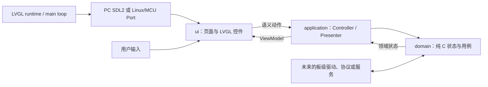
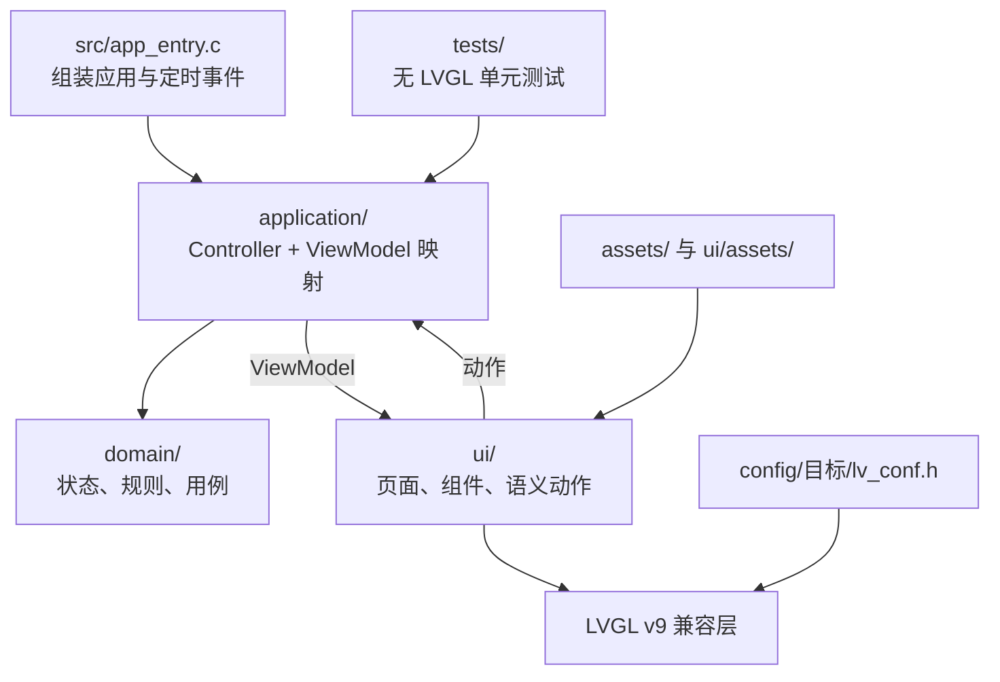
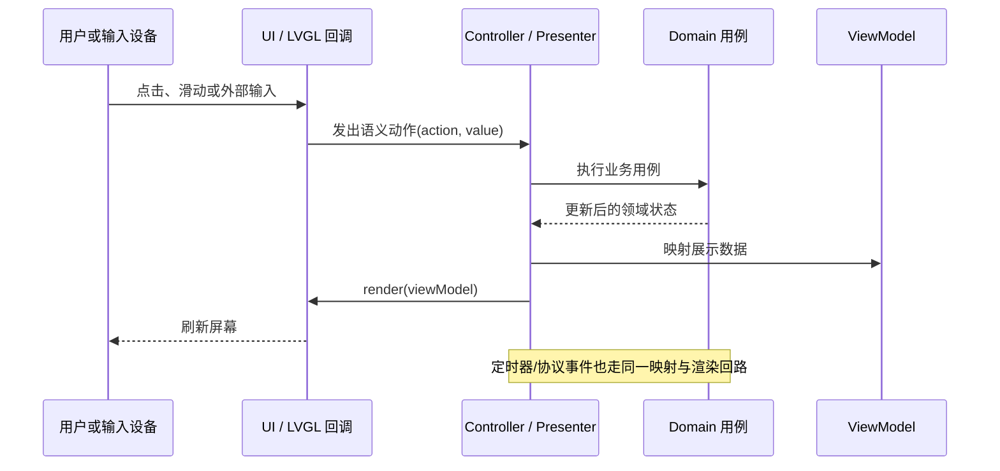

# __APP_NAME__

`__APP_NAME__` 是基于 LVGL-Codex 的独立嵌入式 UI 应用模板。它先在 PC SDL2 模拟器验证，再复用同一份业务与展示逻辑移植到 Linux 开发板或 MCU 板级包。

## 1. 应用目标与边界

首次创建应用后，请把本节替换为真实产品说明。

- **目标**：说明用户要完成的设备操作或信息展示。
- **当前能力**：模板只提供一项示例语义动作、状态和 UI，不接入真实设备。
- **模拟边界**：PC 端仅模拟显示与输入，不访问 GPIO、蓝牙、串口或音频硬件。
- **真实硬件边界**：未来通过 Linux/MCU port 与 board 包接入驱动；不要让 UI 直接调用硬件 API。

## 2. 快速运行

### 单仓模式

在 LVGL-Codex 根目录，使用已安装的 UCRT64 GCC、CMake、Ninja 和 SDL2：

```powershell
cmake -S . -B build/pc-__APP_NAME__ -G Ninja `
  -DLVGL_APP=__APP_NAME__ `
  -DLVGL_TARGET=pc-sdl2 `
  -DLVGL_SERIES=9
cmake --build build/pc-__APP_NAME__
ctest --test-dir build/pc-__APP_NAME__ --output-on-failure
.\build\pc-__APP_NAME__\apps\__APP_NAME__\__APP_IDENTIFIER__.exe
```

Linux fbdev/evdev 必须在 Linux 主机或交叉编译环境执行：

```sh
cmake -S . -B build/linux-__APP_NAME__ -G Ninja \
  -DLVGL_APP=__APP_NAME__ \
  -DLVGL_TARGET=linux-fbdev-evdev \
  -DLVGL_SERIES=9
cmake --build build/linux-__APP_NAME__
ctest --test-dir build/linux-__APP_NAME__ --output-on-failure
LVGL_CODEX_FBDEV=/dev/fb0 LVGL_CODEX_EVDEV=/dev/input/event0 \
  ./build/linux-__APP_NAME__/apps/__APP_NAME__/__APP_IDENTIFIER__
```

### 导出后的独立应用模式

Git subtree 导出的仓库以 `framework_lock.cmake` 锁定框架标签和 LVGL 版本。默认下载锁定框架；开发框架本身时可传入本地框架路径：

```sh
cmake -S . -B build/pc -G Ninja \
  -DLVGL_TARGET=pc-sdl2 \
  -DLVGL_SERIES=9 \
  -DLVGL_CODEX_FRAMEWORK_SOURCE=/path/to/LVGL-Codex
cmake --build build/pc
ctest --test-dir build/pc --output-on-failure
```

## 3. 总体架构



`Runtime` 只管理 LVGL 生命周期与主循环；Port 管理显示、输入和时基。UI 只创建/渲染 LVGL 对象，Application 把语义动作翻译为用例并产出 ViewModel，Domain 保存可移植的业务状态。

## 4. 代码架构



| 目录 | 职责 | 可以依赖 |
| --- | --- | --- |
| `domain/` | 状态、规则、设备协议抽象 | 标准 C、应用纯 C 契约 |
| `application/` | 动作处理、领域调用、ViewModel 映射 | Domain、UI 的动作/ViewModel 声明 |
| `ui/` | LVGL 页面、组件与渲染 | LVGL 兼容层、UI 契约 |
| `src/` | 应用启动、定时事件的组装 | Application、UI、运行时契约 |
| `config/` | 各目标独立 LVGL 配置 | 仅构建系统 |
| `tests/` | Domain/Application 单元测试 | Domain、Application、UI 纯 C 声明 |

## 5. 运行与交互流程



首次实现功能时，将图中的“语义动作”“领域用例”和 ViewModel 字段改成真实名称；不要让 UI 回调直接写入 Domain 对象。

## 6. 代码地图

推荐按以下顺序阅读和修改：

1. `app_manifest.cmake`：确认应用 ID、LVGL 大版本、目标平台和 PC 窗口规格。
2. `src/app_entry.c`：查看应用启动、UI 初始化与定时/外部事件的装配方式。
3. `ui/include/app_ui.h`：先理解动作枚举和 ViewModel，这是 UI 与 Application 的纯 C 契约。
4. `application/include/app_controller.h` 与 `application/src/`：查看动作如何映射为领域调用及展示数据。
5. `domain/include/app_state.h` 与 `domain/src/`：查看真实业务状态和规则应放在哪里。
6. `ui/src/`：最后阅读 LVGL 控件创建、事件回调和 render 逻辑。
7. `tests/test_app_controller.c`：为每个关键动作补充“动作 → 状态 → ViewModel”的测试。

## 7. 分层原理

- **UI 不直接修改业务状态**：LVGL 回调只创建语义动作，因此替换触摸、按键或远程控制入口不会影响业务规则。
- **Domain 不依赖 LVGL**：领域代码可以在 PC、Linux 与 MCU 上复用，也可以无需显示器执行单元测试。
- **ViewModel 是唯一展示输入**：Application 把领域状态转换成文本、数值、开关和页面所需字段，UI 不猜测业务规则。
- **版本与平台差异集中**：LVGL API 差异放在 `framework/lvgl_compat/`，显示/输入差异放在 port 与 board 包；App 分层不散落版本宏。

## 8. 新功能开发流程

以“增加一个页面或设备功能”为例：

1. 在 `ui/include/` 增加语义动作和必要的 ViewModel 字段。
2. 在 `domain/` 定义状态、规则和用例；禁止包含 LVGL、SDL、Linux 或板级头文件。
3. 在 `application/` 处理动作，调用 Domain，并把状态映射为 ViewModel。
4. 在 `ui/` 创建控件；回调只发送动作，`render()` 只消费 ViewModel。
5. 在 `src/app_entry.c` 注册新页面、定时器或外部事件入口。
6. 在 `tests/` 覆盖关键交互的完整映射，并同步更新本 README 的能力、图表和代码地图。

禁止在 UI 中包含 Domain 实现头文件、在 Domain 中调用 LVGL，或在页面回调中绕过 Controller 直接修改状态。

## 9. 平台移植、资源与排错

- **配置档**：每个目标使用独立 `config/<target>/lv_conf.h`。PC SDL2、Linux fbdev/evdev 和未来板级包不得共用同一配置文件。
- **Linux**：通过 `LVGL_CODEX_FBDEV` 指定帧缓冲设备，通过 `LVGL_CODEX_EVDEV` 指定输入设备；未设置输入变量时应用仍可只显示。
- **MCU**：新增 `boards/<vendor>-<board>/`，实现显示 flush、触摸、tick、存储和任务适配；Domain 与 Application 不应因此修改。
- **资源**：把原始素材放入 `assets/source/`，可编译 LVGL 资源放入 `ui/assets/`，并在 `assets/ATTRIBUTION.md` 记录来源和许可。
- **排错**：先运行 CTest 排除动作/映射问题；再在 PC SDL2 检查布局与交互；最后检查目标专用 `lv_conf.h`、设备节点、像素格式和触摸坐标。
